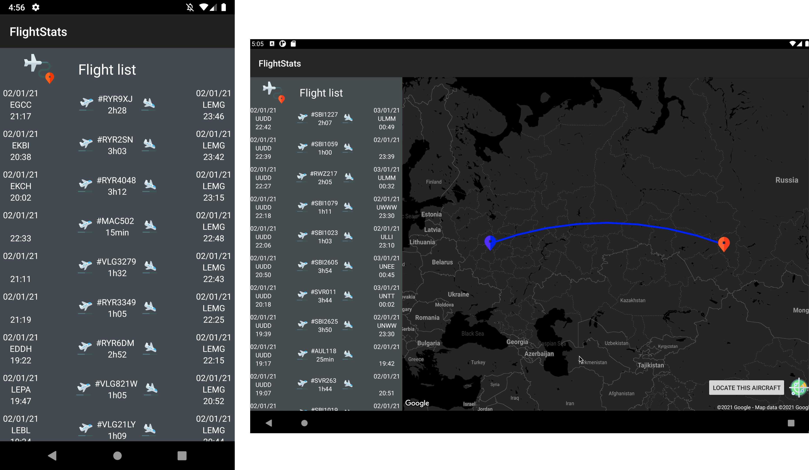

# Flight Stats

# Ecran 1

# Ecran 2

# Ecran 3

# Ecran 4 & 4bis

# Ecran additionnel

# Design original

# App flowchart

L'application a été designée de sorte à toujours chercher des données live en premier lieu (avion en actuellement en vol), puis fallback sur les dernières données disponibles (lastseen).

# Limites de l'API

L'API OpenSky Network a quelques limites qui peuvent altérer l'expérience utilisateur :

 - Il arrive qu'elle ne réponde pas ou que le mode live cesse de fonctionner
 - Les plus récentes données de vols disponibles par aéroport (departure/arrival) sont celles de la veille (J-1)
 - Pour avoir les trajectoires d'un avion en cours de vol, il est nécessaire de faire appel à un endpoint non documenté (https://opensky-network.org/api/routes?callsign={callsign_du_vol})